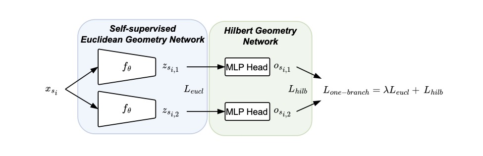

Hyperbolic Contrastive Learning for Document Representations
---------------------------------------------------------------


<figure>
  
  <figcaption>Schematic illustration of our One-branch algorithm. A document is fed twice into the encoder and the similarity in Euclidean and Hilbert geometry is measured for loss calculation.</figcaption>
</figure>
<br>
<br>
<figure>
  
  <figcaption>Schematic illustration of our Two-branch algorithm. A document is fed once and one paragraph from it is fed three times into the encoder. The similarity in Euclidean geometry is measured between two of the paragraph representations and the similarity in Hilbert geometry is measured between the third paragraph embedding and the document embedding.</figcaption>
</figure>

<br>
<br>

## Requirement
For downloading necessary libraries via conda, try:
```
conda install python=3.9
conda install pytorch=1.10.1 cudatoolkit=11.3 -c pytorch
conda install sentence-transformers transformers accelerate ray hpbandster configspace -c conda-forge
```

<br>

## Data pre-processing
E.g. for generating training data for ECtHR, try:
```
python preparation/preprocess_data.py \
--dataset='ecthr' 
--do_doc=True \
--do_par=True \
--path_output='preprocessed_data'
```
Valid arguments for dataset: ecthr, scotus (, mimic available only for huggingface users with access)

<br>

## Domain-adapted Longformer
For domain-adaption of Longformer using Legal-BERT (small) and BioBERT (medium), try:
```
python preparation/convert_bert_to_longformer.py \
--save_directory_bio='bio_longformer' 
--save_directory_legal='legal_longformer' \
```

<br>

## Training and Evaluation
E.g. for training the Two-branch model on ECtHR and conducting linear evaluation, try:
```
python experiment.py \
--dataset='ecthr' --loss_name='simcse_hilbert_2branch' \
--data_type='2branch' \
--path_model='legal_longformer' \
--path_train_output='output' \
--path_eval_output='output' \
--path_data='preprocessed_data'
--steps_per_epoch=2500 --train_learning_rate=1e-5 --train_batch_size=2 \
--train_num_epochs=10 --lambda_value=3.5 --embedding_size=64 \
--simcse_temperature=0.1 --hilbert_temperature=5 \
--eval_num_epochs=20 --eval_learning_rate=3e-5
```

Valid arguments for dataset: ecthr, scotus (, mimic available only for huggingface users with access)

Valid arguments for loss_name: simcse, simcse_hilbert (for One-branch), simcse_hilbert_2branch (for Two-branch)

Valid arguments for data_type: doc_doc (for One-branch using documents), par_par (for One-branch using paragraphs), 2branch (for Two-branch)

<br>

## Training
E.g. for only training the ConvMixer on Cifar-100 using the Modified Debiased Contrastive Loss and Clustering Loss, try:
```
python train.py \
--dataset='ecthr' --loss_name='simcse_hilbert_2branch' \
--data_type='2branch' \
--path_model='legal_longformer' \
--path_output='output' \
--path_eval_output='output' \
--path_data='preprocessed_data'
--steps_per_epoch=2500 --train_learning_rate=1e-5 --train_batch_size=2 \
--train_num_epochs=10 --lambda_value=3.5 --embedding_size=64 \
```

<br>

## Evaluation: Linear Classification
For only training a linear classifier on top of the frozen backbone network and evaluation, enter the path to the trained model and try:
```
python linear_evaluation.py \
--dataset='ecthr' --path_model='' --path_output='output' --eval_num_epochs=20 --eval_learning_rate=3e-5
```

<br>

## Acknowledgements
The code is based on the work of [Ilias Chalkidis](https://github.com/iliaschalkidis), [Mina Rezaei](https://github.com/MinaRe), and [Daniel Saggau](https://github.com/danielsaggau).

<br>

## How to cite 
Please cite [our paper published in ECAI](https://ebooks.iospress.nl/doi/10.3233/FAIA240673):

Nam, J., Chalkidis, I., & Rezaei, M. (2024). 
Hyperbolic Contrastive Learning for Document Representations - A Multi-View Approach with
Paragraph-level Similarities. 
ECAI 2024: Proceedings of the 27th European Conference on Artificial Intelligence.
https://doi.org/10.3233/FAIA240673

